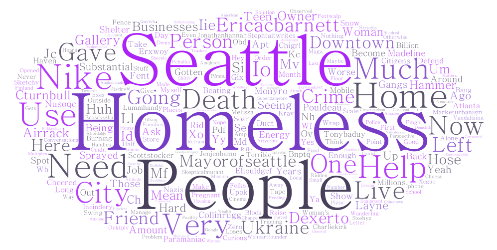
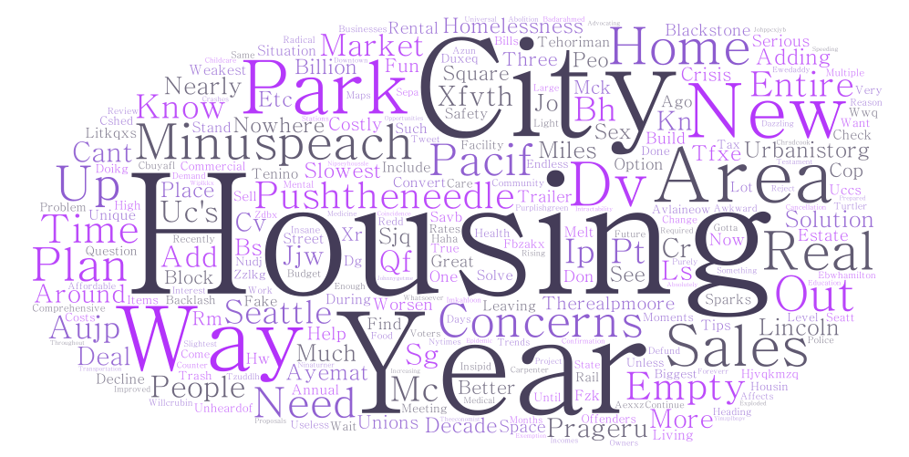
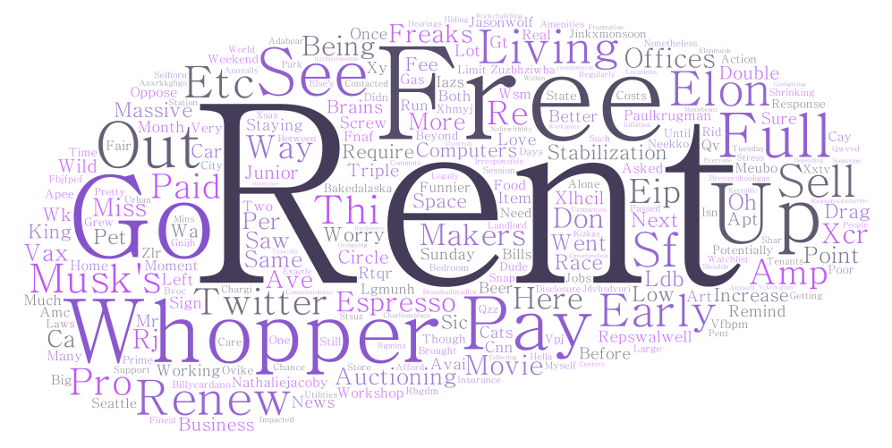

# Housing in Seattle
## Geog 458 Lab 2
### Ryan Fournier

#### Topic and parameters
I chose to look at housing related things in Seattle. The three topics I chose to search were:
* housing
* rent
* homeless

#### Reasoning behind comparison
I wanted to make this comparison because it seems like an issue that we are facing and I feel that Twitter would be a great place to start as a search. Also, if some event happened during a curtain time, then it would likely show up on the search as people could end up complaining about it.

#### Word clouds

These word clouds include a few of the same ideas in them such as the City of Seattle, and the Mayor in the homeless one. Offices seems to show up a few times. It seems that the homeless one is highlighting a lot of the issues of homeless and problems in the city that they are located. The housing one is mostly about concerns and parks in areas along with sales. The rent one seems to be focused on paying rent as well as free rent in some areas.

#### Reasons for patterns
I believe there are some patterns in this data for a few reasons. I think part of it has to do with the fact that its Twitter and it is such a broad audience of users. It is also so easy to send out a tweet without putting much thought into it, which leads to some of those ranting tweets. I feel as though that some of these were written because so and so's roommate didnt pay rent, so they complained on Twitter. Or another being that Nike Town in downtown is closing because of the homeless.

#### How to improve
I think the best way I could improve is by getting the full tweets rather than just the shortened versions that were provided by this package. I also think it would be beneficial to me to apply for an academic account which would allow me to go back further in time and select specific dates that could be key areas to study.

#### CSV downloads
[Homeless CSV](https://github.com/4nierr/Geog458Lab2Deliverable/blob/main/assets/twsearch-result-1.csv)

[Housing CSV](https://github.com/4nierr/Geog458Lab2Deliverable/blob/main/assets/twsearch-result-2.csv)

[Rent CSV](https://github.com/4nierr/Geog458Lab2Deliverable/blob/main/assets/twsearch-result-3.csv)
